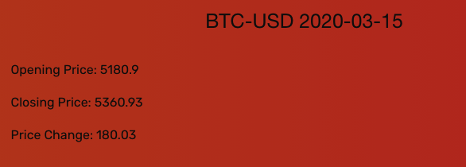
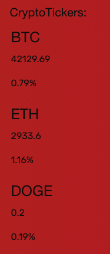

# Crypto Watcher

Crypto Watcher is a cryptocurrency data tracking tool. Users can use cryptotracker to fin a variety of information on a given cryptocurrency including:
- current rank
- current value
- highest value in the past 24 hours
- percent change in the last hour, day, week, and month

historical data for a specific date within the past 2 years including:
- opening price
- closing price
- price change

Each time a cryptocurrency is searched a ticker is created (up to 3 tickers). Tickers refresh every 5 minutes and display the cryptocurrency's current value and % change.

## Resources
Crypto Watcher was built with HTML, CSS, and Javascript. It also uses the CSS freamework Foundation, as well as JQuery and moment.js. Crypto Watcher uses the coinlib API (https://coinlib.io/apidocs) and the polygon API (https://polygon.io/docs) to fetch crypto information.
